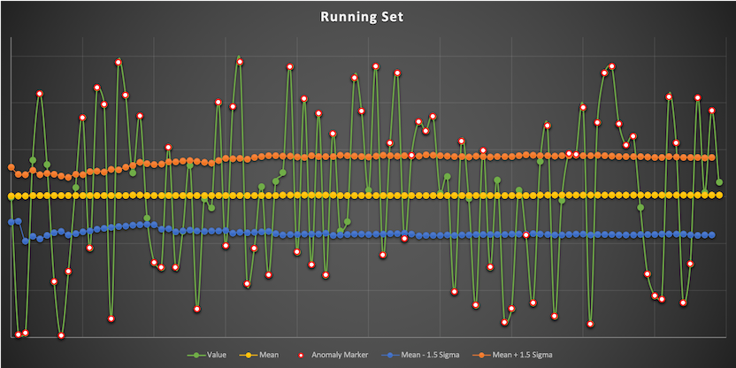

# Demos

The scope of these demos is to show basic use cases on how the online statistics library can be used to detect anomalies
in data streams.

## Demo 01

This demo is showing the use of *total* online statistics over a data stream. By *total* we mean statistics that take
into account all the values that were processed since the process started.

The data stream is showing the single constant but noisy feature or a band feature (a feature with values between two
given limits, e.g. values from 10 to 20).
For example the temperature of a server or the ping times between two servers in the same rack.
One of the biggest problems in this case is the variance slowly growing, in case the anomaly detection function is
too lenient.

In this demo we used an anomaly detection function that marks as anomaly any data point further than 1.5 standard
deviations from the median value. Using this strict criteria, the variance becomes stable instead of continuously
increasing.

The graph below is showing the data used for training, which is assumed to be good quality and showing a reasonably
normal behavior.

The graph below is showing the data used for detecting anomalies, pointing them out.

## Demo 02

This demo is showing the use of exponentially moving statistics over a data stream. The main parameter, *alpha*,
is controlling the weight of the current record over the exponential weight of the history.

The data stream is showing a single noisy sinusoidal signal, like the temperature over the course of a day, or
the heart rate over a day.

The function to detect anomalies, in this case, is based on the probability that a record is within 3 standard
deviations from the average.

The graph below is showing the data used for training, which is assumed to be good quality and showing a reasonably
normal behavior.

The graph below is showing the data used for detecting anomalies, pointing them out. The data is picking up where the
training data left of, thus continuing the sinusoidal behavior.

